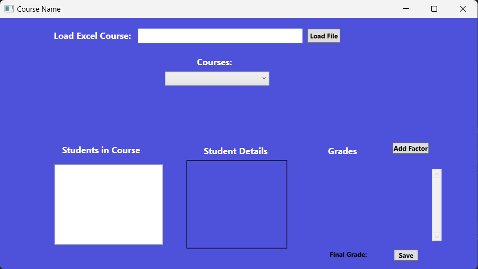
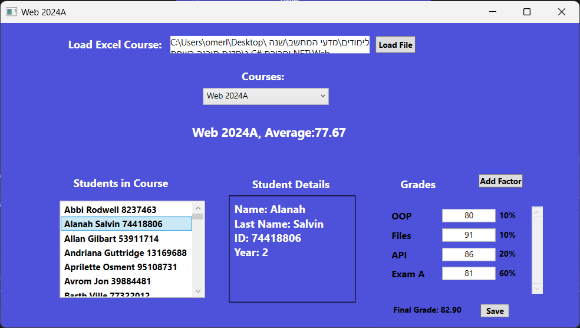

# Student Grade Tracker

## Description

Student Grade Tracker is an application designed to manage and track student grades across various courses. It provides educators with tools to monitor student progress and offers students insights into their performance.

## System Requirements

- Windows 10 or higher
- .NET Framework 4.7.2 or later

## Installation

To install the application, follow these steps:

1. Download the code from GitHub.
2. Open the project in Visual Studio.
3. Execute the `dotnet restore` command to install dependencies.
4. Build and run the project.

## Quick Start

After installation, you can start the application through Visual Studio or by running the executable file generated.

## Features

- Load student data from Excel files.
- Save data in JSON files to preserve information between sessions.
- Calculate averages and manage grades.
- Update and display grades in real-time via a graphical interface.

### Usage

- By clicking on the "Load" button, you will load a csv file containing the information about the students in the course you chose to check.
- After uploading the CSV file, you can change the grades of the students, you can also give a factor to all the students, you can see the average of each student and the overall average of the course

  

  

